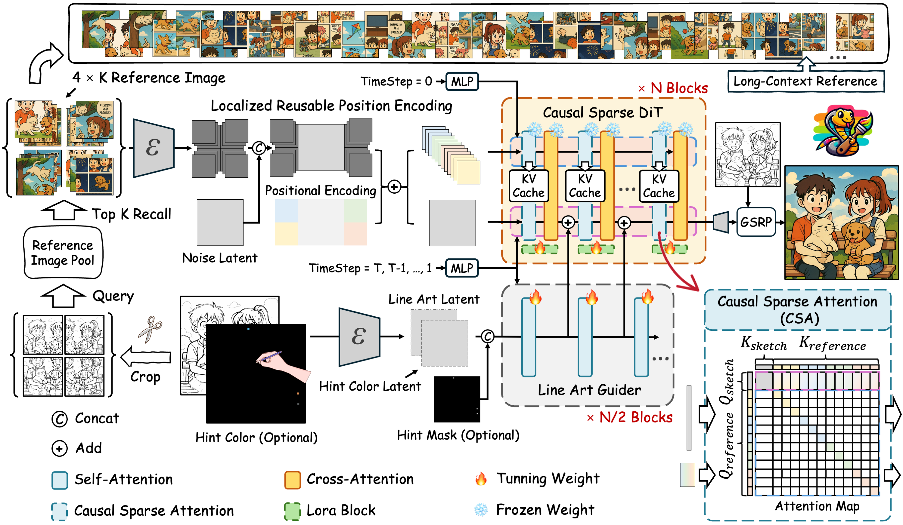

# 🎨 Cobra

**Efficient Line Art COlorization with BRoAder References**

**Authors:** Junhao Zhuang, Lingen Li, Xuan Ju, Zhaoyang Zhang, Chun Yuan† and Ying Shan†

<a href='https://zhuang2002.github.io/Cobra/'></a> &nbsp;
<a href='https://huggingface.co/spaces/JunhaoZhuang/Cobra'></a> &nbsp;
<a href="https://arxiv.org"></a> &nbsp;
<a href="https://huggingface.co/JunhaoZhuang/Cobra"></a>

**Your star means a lot for us to develop this project!** :star:


### 🌟 Abstract 

The comic production industry requires reference-based line art colorization with high accuracy, efficiency, contextual consistency, and flexible control.
A comic page often involves diverse characters, objects, and backgrounds, which complicates the coloring process.
Despite advancements in diffusion models for image generation, their application in line art colorization remains limited, facing challenges related to handling extensive reference images, time-consuming inference, and flexible control.
We investigate the necessity of extensive contextual image guidance on the quality of line art colorization. To address these challenges, we introduce **Cobra**, an efficient and versatile method that supports color hints and utilizes **over 200 reference images** while maintaining low latency. 
Central to Cobra is a Causal Sparse DiT architecture, which leverages specially designed positional encodings, causal sparse attention, and Key-Value Cache to effectively manage long-context references and ensure color identity consistency.
Results demonstrate that Cobra achieves accurate line art colorization through extensive contextual reference, significantly enhancing inference speed and interactivity, thereby meeting critical industrial demands.

### 📰 News

- **Release Date:** April 17, 2025 - The inference code and model weights have also been released! 🎉

### 📋 TODO

- ✅ Release inference code and model weights
- ⬜️ Release training code

### 🚀 Getting Started

Follow these steps to set up and run Cobra on your local machine:

- **Clone the Repository**
  
  Download the code from our GitHub repository:
  ```bash
  git clone https://github.com/zhuang2002/Cobra
  cd Cobra
  ```

- **Set Up the Python Environment**

  Ensure you have Anaconda or Miniconda installed, then create and activate a Python environment and install required dependencies:
  ```bash
  conda create -n cobra python=3.11.11
  conda activate cobra
  pip install -r requirements.txt
  ```

- **Run the Application**

  You can launch the Gradio interface for Cobra by running the following command:
  ```bash
  python app.py
  ```

- **Access Cobra in Your Browser**

  Open your browser and go to `http://localhost:7860`. If you're running the app on a remote server, replace `localhost` with your server's IP address or domain name. To use a custom port, update the `server_port` parameter in the `demo.launch()` function of app.py.

### 🎉 Demo

You can [try the demo](https://huggingface.co/spaces/JunhaoZhuang/Cobra) of Cobra on Hugging Face Space.

### 🛠️ Method

The overview of Cobra.
This figure depicts the framework of Cobra, which utilizes a large collection of retrieved reference images to guide the colorization of comic line art. The framework effectively manages an arbitrary number of contextual image references through localized reusable positional encoding, ensuring appropriate aspect ratios and resolutions. Additionally, the causal sparse DiT architecture processes long contextual references, enhancing identity preservation and color accuracy while reducing computational complexity. The integration of optional color hints further ensures user flexibility, culminating in high-quality coloring that is highly suitable for industrial applications.



🤗 We welcome your feedback, questions, or collaboration opportunities. Thank you for trying Cobra!

### 📄 Acknowledgments

We would like to acknowledge the following open-source projects that have inspired and contributed to the development of Cobra:

- **MangaLineExtraction_PyTorch**: https://github.com/ljsabc/MangaLineExtraction_PyTorch

We are grateful for the valuable resources and insights provided by these projects.

### 📞 Contact

- **Junhao Zhuang**  
  Email: [zhuangjh23@mails.tsinghua.edu.cn](mailto:zhuangjh23@mails.tsinghua.edu.cn)

### 📜 Citation

```
@misc{zhuang2025cobra,
title={Cobra: Efficient Line Art COlorization with BRoAder References},
author={Junhao Zhuang, Lingen Li, Xuan Ju, Zhaoyang Zhang, Chun Yuan† and Ying Shan†},
year={2025},
eprint={*****},
archivePrefix={arXiv},
primaryClass={cs.CV},
url={https://arxiv.org/abs/****},
}
```

